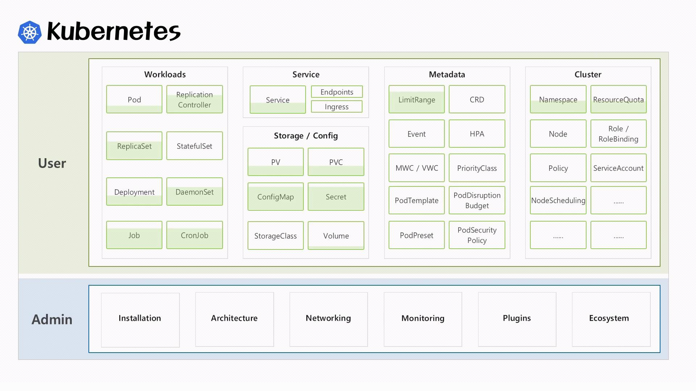

## Intro
- VM 가상화를 하기 위해서 무거운 OS를 띄워야 한다는 근본적인 문제
- 가벼운 서비스를 하나 띄우기 위해 이보다 더 큰 OS를 띄워야 하는 경우도 생김
- 컨테이너 가상화 기술은 서비스 간의 자원 격리를 하는데 OS를 별도로 안띄워도 됨
- OS 기동시간이 없기 때문에 자동화시 엄청 빠르고, 자원 효율도 매우 높음
- 이때부터 도커가 유명세를 탔음. 근데 도커 자체는 하나의 서비스를 컨테이너로 가상화시켜서 배포를 시키는 거지, 엄청 많은 서비스들을 운영할 때 그걸 일일이 배포하고 운영하는 역할을 해주지는 않음. -> 컨테이너 오케스트레이터

## 쿠버네티스는 할게 많다!
