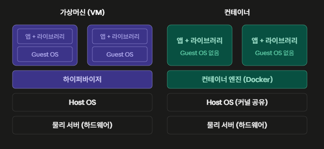

## VM vs Container

결국 "어느 층에서 격리하느냐"의 차이.

### 물리 서버 (Host Server / 하드웨어)
말 그대로 진짜 기계. CPU, 메모리, 디스크 네트워크 카드가 달린 물리적인 서버 장비.모든 것의 맨 밑바닥 층.

### Host OS (호스트 운영체제)
그 물리 서버에 직접 설치된 운영 체제, 고객사 서버에 Rocky Linux나 Ubuntu를 깔았다면 그게 Host OS이다. "Host"라는 말은 "이 하드웨어의 주인 OS"라는 뜻이고, 뒤에 나올 Guest OS와 구분하기 위한 상대적인 명칭.

### Hypervisor (하이퍼바이저)
가상머신을 만들고 관리하는 소프트웨어 층. 핵심 역할은 하드웨어를 흉내내는 것. 물리 서버의 CPU, 메모리, 디스크를 쪼개서 각 VM에게 "너는 독립된 컴퓨터야"라고 믿게 만드는 가짜 하드웨어를 제공. 두 종류가 있는데 그림처럼 Host OS 위에서 프로그램을 도는 것이 Type2(VirtualBox, VMware workstation - 개발 PC에서 쓰는 것들), Host OS 없이 하드웨어 위에 하이퍼바이저가 직접 깔리는 것이 Type1 (VMware ESXi, KVM - 데이터센터 서버용). 고객사 전산실 가상화 환경은 대부분 Type1이다.

### Guest OS (게스트 운영체제)
하이퍼바이저가 만들어준 가상 컴퓨터 안에 설치되는 운영체제. VM 하나를 만든다는 건 그 안에 Linux나 Windows를 통쨰로 새로 설치한다는 뜻. 이게 VM의 강점이자 약점의 근원. OS가 통째로 있으니 격리가 완벽하고 Host와 다른 OS로 돌릴 수 있지만 VM마다 수 GB의 OS와 커널이 중복으로 올라가고 부팅에 분 단위가 걸림. 그림에서 코랄색으로 칠한 이유가 이 "VM마다 반복되는 비용"을 보여주기 위함.

### 컨테이너
여기가 핵심의 차이. 컨테이너는 하드웨어를 흉내내지 않고, Host OS의 커널을 그대로 같이 쓰면서 프로세스만 격리.컨테이너 안에는 앱과 그 앱이 필요로 하는 라이브러리만 들어 있고, Guest OS가 없다. 그래서 본질적으로 컨테이너는 "가상 컴퓨터"가 아니라 잘 포장되고 격리된 프로세스. Host에서 PS 명령어를 치면 컨테이너 안에서 도는 자바 프로세스가 그냥 보인다. 별도 컴퓨터가 아닌 같은 OS 위의 프로세스이기 때문.

그럼 OS 없이 어떻게 격리하느냐 ?   
Linux 커널의 두가지 기능. namespace는 "보이는 범위"를 격리.
이 프로세스에게는 자기만의 프로세스 목록, 자기만의 네트워크 인터페이스, 자기 만의 파일 시스템 루트만 보이게 함. cgroup은 "쓸 수 있는 양"을 제한. CPU 몇 %, 메모리 몇 GB만 쓰게하는 것. 도커는 이 커널 기능들을 쓰기 쉽게 포장해준 도구이고, 그래서 그림의 컨테이너 엔진층이 하이퍼바이저보다 훨씬 얇은 층이다.

### 이 구조 차이에서 나오는 실무적 결과

Guest OS가 없다는 한 가지 차이에서 나머지가 전부 따라 나옴. 컨테이너는 OS 부팅이 없으니 시작이 초 단위가 아니라 밀리초 ~ 초 단위고, 이미지 크기가 GB가 아니라 수십 ~ 수백 MB이고, 한 서버에 수십 ~ 수백개를 올릴 수 있다. 반대로 커널을 공유하기 때문에 Host가 Linux면 Linux 컨테이너만 들 수 있고 (Windows에서 도커가 내부적으로 경량 Linux VM을 띄우는 이유), 커널 취약점이 뚫리면 격리가 깨질 수 있어 보안 격리 강도는 VM이 더 강함. 그래서 금융권처럼 강한 격리가 필요한 곳은 "VM 위에 컨테이너"를 겹쳐 쓰는 경우가 많음

### 정리
VM은 하이퍼바이저가 하드웨어를 가상화 하여 Guest OS를 통째로 올리는 방식, 컨테이너는 Host OS커널을 공유하면서 namespace, cgroup으로 프로세스 수준에서 격리하는 수준. 그래서 VM은 격리가 강하지만 무겁고, 컨테이너는 가볍지만 커널을 공유한다는 제약과 보안 트레이드 오프가 있다.