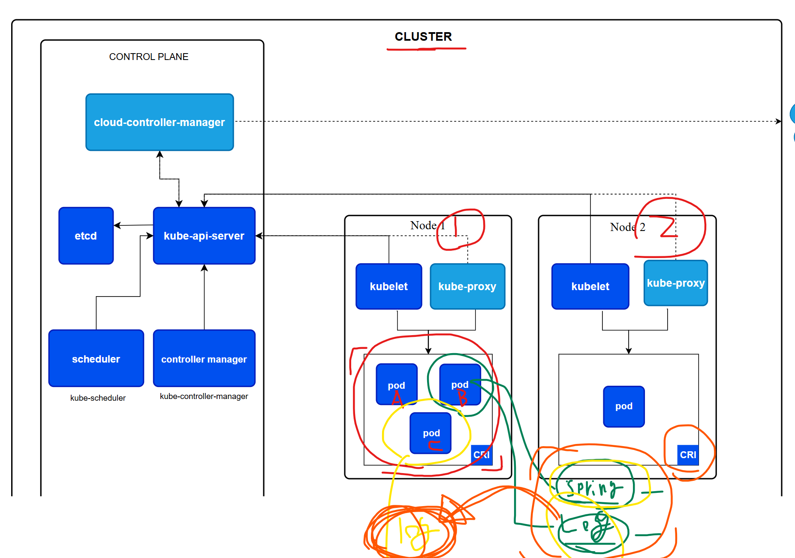

# 쿠버네티스 개념

## 1. 전체 구조: CLUSTER
가장 바깥 박스가 클러스터 하나. 내부는 크게 두 영역으로 나뉜다.
- Control Plane (좌측) - "무엇을 띄울지" 결정하는 두뇌
- Node1 / Node2 (우측) - 실제 컨테이너가 도는 워커 서버.

## 2. Control Plane 구성요소
| 구성요소                     | 역할                                                                                                 |
|--------------------------|----------------------------------------------------------------------------------------------------|
| Kube-api-server          | 클러스터의 유일한 정문. 모든 요청(kubectl, 컨트롤러, kubelet)은 반드시 여기를 거친다.                                          |
| excd                     | 클러스터의 모든 상태를 저장하는 key-value DB, 오직 api-server만 접근한다.                                               |
| Kube-scheduler           | 아직 노드가 정해지지 않은 Pod를 보고, 자원/제약 조건을 계산해 "이 Pod는 Node2로" 하고 배치를 결정                                    |           
| Kube-controller-manager  | 원하는 상태(desired state)와 현재 상태를 계속 비교해 맞춰주는 루프들의 모임(ReplicaSet, Node, Job 컨트롤러 등)                    |
| cloud-controller-manater | AWS/GCP 같은 클라우드와 연동되는 부분만 분리한 컨트롤러, LoadBalancer 생성, 노드 정보 조회, 볼륨 연결 등을 담당, 온프레미스 클러스터에는 없을 수도 있다. | 

## 3. Node 구성요소
- Kubelet : 각 노드의 에이전트,api-server에게 "너한테 배정된 Pod 목록"을 받아 실제로 컨테이너를 띄우고, 헬스체크 결과와 상태를 다시 보고한다.
- Kube-proxy : 노드의 네트워크 규칙 (iptables/IPVS) 담당. Service로 들어온 트래픽을 실제 Pod IP로 분배한다.
- CRI (Container Runtime Interface) : Kubelet이 건테이너 런타임(Containerd, CRI-O 등)에게 명령을 전달하는 표준 규격, 실제로 컨테이너를 만들고 실행하는 건 이 런타임.
- Pod : 배포의 최소 단위, 컨테이너 1개 이상 + 네트워크/스토리지를 공유하는 묶음

## 4. 화살표의 의미 <- 여기가 핵심
모든 화살표가 Kube-api-server를 향한다는게 이 그림에서 가장 중요한 메시지다. 구성요소끼리 직접
대화하지 않고, 전부 api-server를 통해서만 소통한다 (허브 앤 스포크 구조)
- api-server <-> etcd : 상태를 읽고 쓴다. etc로 가는 선은 api-server 하나뿐 - 다른 누구도 DB를 직접 못 건든다.
- scheduler -> api-server : "노드 미배정 Pod 있나?" 감시(Watch) -> 결정하면 "이 Pod는 Node 1" 이라고 api-server에 기록
- controller manager -> api-server : 현재 상태를 감시하다 부족하면 "Pod 하나 더 만들어 라고 api-server에 요청"
- cloud-controller-manager <-> api-server : 양방향 화살표. 클러스터 상태를 읽고, 클라우드에서 얻은 정보를 다시 쓴다.
- cloud-controller-manager -> (점선, 오른쪽 바깥) : 클러스터 밖의 클라우드 제공자 API로 나가는 호출. 점선인 이유는 클러스터 경계를 넘는 외부 연결이기 때문이다.
- Kubelet -> api-server : 노드가 중앙에서 접속한다. 반대가 안디ㅏ. 이 방향이 중요한 이유는 노드가 NAT 뒤에 있거나 방화벽 안에 있어도 동작하기 때문이다. (단, kubectl logs/exec 같은 경우엔 예외적으로 api-server -> kublet 방향 연결이 생긴다.)
- kube-proxy -> api-server (점선 : service/Endpoint 변경을 감지해서 자기 노드의 네트워크 규칙을 갱신한다.)
- kubelet -> Pod 박스 (아래 방향 화살표): 명령어 전달 방향. Kubelet이 CRI를 통해 컨테이너를 생성, 시작, 종료시킨다.
- kube-proxy -> Pod 박스, 트래픽이 실제로 흘러가는 경로

> 한줄로 요약하자면, 결정은 위에서 아래로 (스케줄러가 배치를 정하고 -> Kubelet이 실행), 보고는 아래에서 위로 (Kubelet이 상태 보고 -> etcd 기록) 흐르며, 그 사이는 전부 api-server가 중계한다.